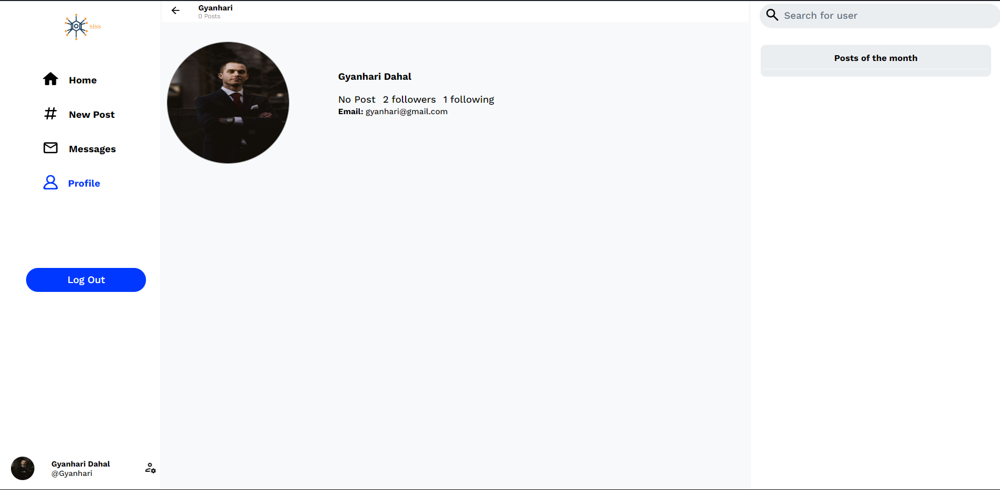
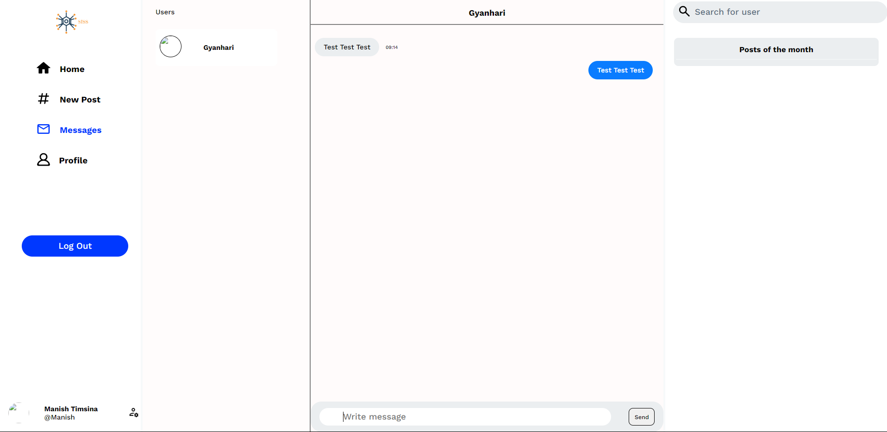
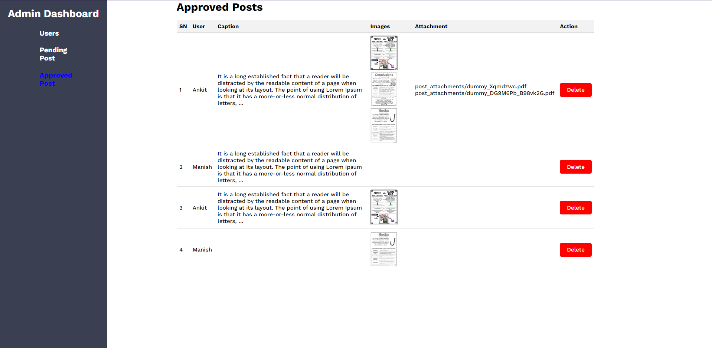

## Twitter like Website By **Ankit-Rawal**, **@Varl-Starkiller**, **@Manish2467**
### Idea Sharing Site
Contains Features Like
- Post
- Comment
- Follow
- Chatting (using Web-sockets)

## Sample of the Final Project

Home Page

Profile Page

Message Page

Admin Dashboard

## Installation

### Database Requirement

This project is using a MySQL database, so you will need to have XAMPP or WAMP installed on your system.

1. **XAMPP**: Download and install XAMPP from [the official website](https://www.apachefriends.org/index.html).
2. **WAMP**: Download and install WAMP from [the official website](https://www.wampserver.com/en/).

**Database Name**: `social_book`
import the file `database(name=social_book)` after creating the database

### Admin Credentials

To access the administrative dashboard, use the following credentials:

- **Username**: `admin`
- **Password**: `admin`

### How to Start

* Clone this repo
* Start a virtual environment using the following commands
   1. `python -m venv venv`
   2. `.\venv\Scripts\activate`
* Install the required packages using the command
   1. `python -m pip install -r requirements.txt`
* Start apache server and mysql server 
* Open the terminal and enter the following command
    1. `python manage.py runserver`

